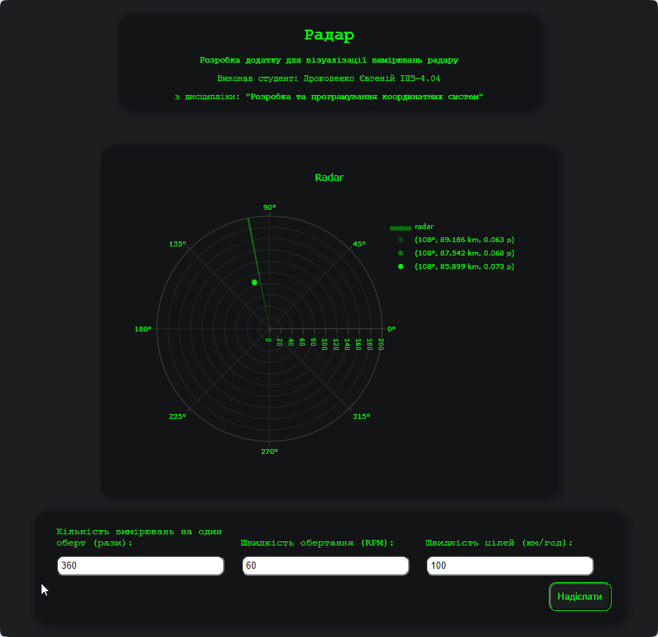
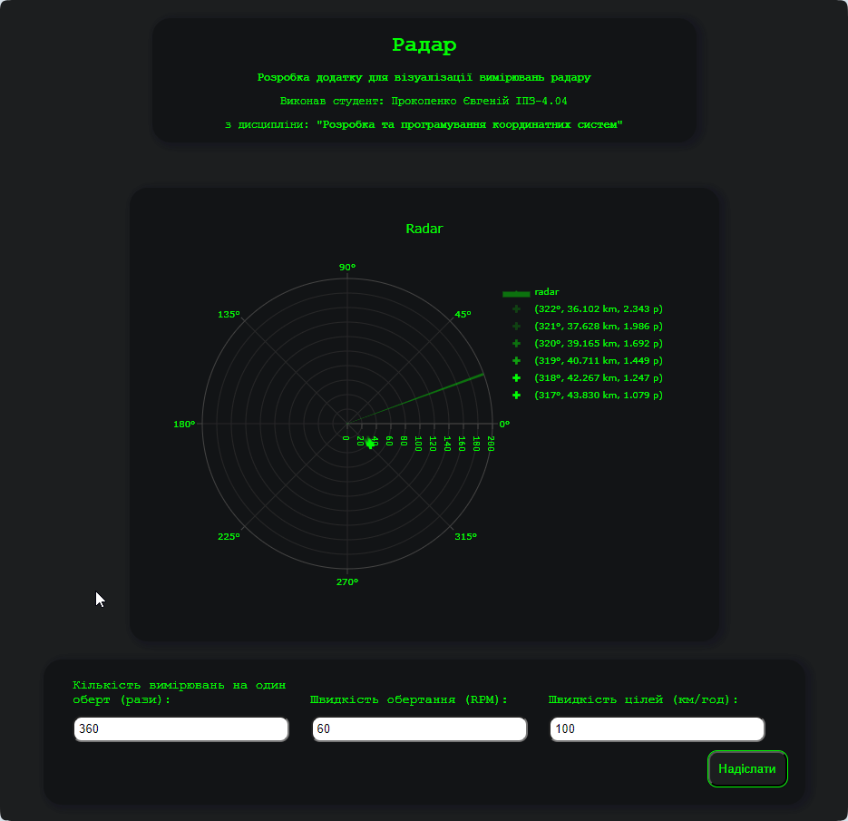

## Титул
## Розробка додатку для візуалізації вимірювань радару
## Виконав студент: Прокопенко Євгеній ІПЗ-4.04
## з дисципліни: **"Розробка та програмування координатних систем"**

## Завдання

Згідно до поставленого завдання необхідно було створити веб-додаток, що в реальному часі відображає дані про задетектовані цілі на графіку та дозволяє змінювати параметри радару.

1. **Розробити додаток для відображення цілей:**
    - Розробити веб-додаток, який підключається до WebSocket сервера та зчитує дані про задетектовані цілі;
    - Відобразити отримані дані на графіку в полярних координатах. Як варіант, можна використати бібліотеку Plotly або іншу бібліотеку для роботи з графіками.
2. **Обробка та візуалізація даних:**
    - Обробити дані, отримані через WebSocket, і відобразити цілі на графіку;
    - Кожна ціль повинна бути представлена як точка на графіку з координатами (кут, відстань);
    - Додати можливість зміни параметрів вимірювальної частини радару за допомогою API запитів.
3. **Налаштування графіка:**
    - Відобразити відстань у кілометрах на радіальній осі;
    - Використати різні кольори або стилі точок для відображення різних рівнів потужності сигналів, що повертаються від цілей.

## Конфігурація середи

Емулятор вимірювальної частини радару надається у вигляді Docker зображення під назвою radar-emulation-service.

Команда завантаження Docker зображення з Docker Hub:

> docker pull iperekrestov/university:radar-emulation-service

Запуск контейнера з ім'ям `radar-emulator` з відкриттям порту `4000` для з'єднання з емульованою вимірювальною частиною радару:

```bash
 docker run --name radar-emulator -p 4000:4000 iperekrestov/ 
radar-emulation-service:latest
```
## API радара

Сервіс підтримує API для зміни наступних параметрів вимірювальної частини радару:

- `measurementsPerRotation` : кількість вимірювань на один оберт (одиниці: рази); 
- `rotationSpeed`: швидкість обертання (одиниці: обертів за хвилину, RPM); 
- `targetSpeed`: швидкість цілей (одиниці: км/год).

За замовчуванням застосовані наступні параметри:

- `measurementsPerRotation`: 360 (рази);
- `rotationSpeed`: 60 (обертів за хвилину);
- `beamWidth`: 1 (градус);
- `numberOfTargets`: 1;
- `targetSpeed`: 100 (км/год);
- `emulationZoneSize`: 200 (км).

Дані, які надсилаються через WebSocket з емульованої частини радару, містять інформацію про задетектовані цілі. Повідомлення представляються у форматі JSON і мають наступну структуру:

```bash
{
  "scanAngle": 90, // Кут зондування у градусах (від 0 до 360)
  "pulseDuration": 1, // Тривалість імпульсу в мікросекундах
  "echoResponses": [
    {
      "time": 0.000012, // Час поширення імпульсу в секундах (двосторонній шлях)
      "power": 0.05 // Потужність відбитого сигналу (значення від 0 до 1)
    },
    {
      "time": 0.000024, // Час поширення імпульсу іншої цілі в секундах
      "power": 0.02 // Потужність відбитого сигналу іншої цілі
    }
  ]
}
```

## Розробка проєкта

#### 1. Технології

Для створення додатку візуалізації радара було обрано JavaScript, HTML і CSS через їхню потужність у створенні інтерактивних та стильних інтерфейсів. JavaScript дозволяє динамічно оновлювати дані та управляти взаємодією користувача. HTML надає структуру, а CSS — стилізацію.

Для графіків було вирішено використовувати Plotly, що забезпечує розширені можливості для створення графічних візуалізацій. 

Серверна частина налаштована з використанням Express і middleware для проксі, що дозволяє зручно обробляти запити, маршрутизацію та є необхідною для вирішення обмежень браузерної системи. Node.js забезпечує середовище для виконання серверного коду.
Для управління залежностями було застосовано npm. 

#### 2. CORS політика

CORS (Cross-Origin Resource Sharing) — це механізм, який дозволяє веб-додаткам, що виконуються в одному домені, взаємодіяти з ресурсами, що знаходяться на іншому домені.

Для можливості відправлення запиту (наприклад, POST, PUT) з браузеру від імені іншого домену до домену конфігурації Docker зображення радара (`http://localhost:4000/config`) необхіно, щоб веб-сервер дозволяв подібні запити з інших доменів.

Шляхом випробувань було з'ясовано, що веб-сервер не відповідає на `OPTIONS` запити браузера своїми спеціальними заголовками.

Для вирішення цієї проблеми було зроблено налаштування проксі-сервера з використанням пакетів `express` і `http-proxy-middleware`, для вирішення проблеми з CORS політикою браузера. Проксі-сервер на порту `3000` перенаправляє запити до конфігураційного сервера Docker на `http://localhost:4000`. Це дозволяє обробляти запити, такі як `POST` і `PUT`, які можуть бути заблоковані через обмеження `CORS`.

Конфігурація включає:

- Проксі для API: Перенаправлення запитів з /api до цільового сервера, забезпечуючи правильне оброблення заголовків CORS;
- Обробка статичних файлів: Сервер обробляє статичні ресурси з директорії `public`;
- Встановлення гоовної сторінки: Відповідає на запити до кореневого маршруту, надаючи основний HTML файл.

Налаштування веб-серверу відбувається у головному js файлі веб-сервера — `proxy.js`. 

Запуск проєкта виконується командою:

> node proxy.js

#### 3. Приймання повідомлень радара

Для приймання повідомлення від радару було створено клас `RadarService`, файл `public/src/RadarService.js`.

Цей клас відповідає за: 
- Отримання конфігурації радара — метод `fetchConfiguration`;
- Оновлення конфігурації радара — метод `updateConfiguration`;
- Підключення до веб-сокета та подальше створення глобальних подій отримання повідомлення — метод `connectWebSocket`.

Конструктор класа приймає об'єкт, що повинен містити наступні параметри:
- `configUrl`: адреса конфігурації радара;
- `socketUrl`: адреса сокета;
- `eventName`: назва події, яку генерує сервіс при отриманні повідомлення з радару.

Отримання поточної конфігурації радара відбувається з застосуванням функції `fetch`:

```javascript
const response = await fetch(this.props.configUrl, {
        method: "PUT",
        headers: {
          "Content-Type": "application/json",
        },
      });
```

Підключення до веб-сокету відбувається з застосуванням класа `WebSocket`:

```javascript
this.websocket = new WebSocket(this.props.socketUrl);

    this.websocket.onmessage = (event) => {
      try {
        const data = JSON.parse(event.data);

        data.beamWidth = this.config.beamWidth;

        const customEvent = new CustomEvent(this.props.eventName, {
          detail: data,
        });
        window.dispatchEvent(customEvent);
      } catch (error) {
        console.error("Failed to parse data:", error);
      }
    };
```

#### 4. Будування радара

Для керуванням створення та оновлення графіка радара, було створено клас `RadarGraph`, файл `public/src/RadarGraph.js`.

Цей клас відповідає за: 
- Будування графіка — метод `init`;
- Обробку нових даних з підписки до події радара — метод `handleData`;
- Додання нових точок на графік — метод `addPoint`;
- Поступове зникнення точки на графіку — метод `erazeTrace`.

Конструктор класа приймає об'єкт, що повинен містити наступні параметри:
- `plotId`: ідентифікатор html блоку для малювання радара;
- `eventName`: назва події, що відповідає за передачу даних з радару.

В методі `init` відбувається налаштування перебудови графіка радара через певний проміжок часу, що не залежить від потоку повідомлень з радару. Це дозволяє забеспечити стабільну роботу системи.

Радар виконаний у специфічному стилі: яскравий зелений текст та позначки на темному фоні, саме зелений колір дозволяє досягнути найбільшої контрастності та задати атмосферу використання.

В залежності від рівня отриманої потужності сигналу з цілі, виконується різне позначення цілі на графіку:
- Від 0 до 0.3: кружечок;
- Від 0.3 до 0.5: квадрат;
- Від 0.5 до 0.1: діамант;
- Від 1: хрест.

В легенді графіка позначається потужність сигналу та координати кожної цілі, яка з'являється на радарі.

#### 5. Оновлення конфігурації

Для керуванням форми оновлення конфігурації радара, було створено клас `RadarConfig`, файл `public/src/RadarConfig.js`.

Цей клас відповідає за: 
- Валідацію форми конфігурації радара — метод `handleSubmit`;
- Встановлення поточної конфігурації радара у поля форми — метод `setConfig`.

Конструктор класа приймає елемент форми та калбек, який приймає об'єкт конфігурації радара та буде викликатися при успішній валідації усіх полів.

#### 6. Головний скрипт index.html

При готовності документа виконується запуск головної асинхронної фунції:

```js
async function main() {

    // Отримання конфігурації радара
    await radarService.fetchConfiguration();

    // Підключення до веб-сокета
    radarService.connectWebSocket();

    // Запуск циклу будування радара
    radarGraph.init(radarService.config);

    // Заповнення форми конфігурації радара
    radarConfig.setConfig(radarService.config);
}

$(document).ready(function () {
    main();
});
```

#### 7. Результат

Виконаємо запуск проєкта: Docker зображення та проксі сервера.

**Результат:**



Спробуємо змінити параметри радара.

**Результат:**



**Радар працює, запити зміни конфігурації виконуються!**

## Висновок

RADAR — це пристрій, що використовується для виявлення об'єктів та визначення їхнього місцезнаходження та руху за допомогою радіохвиль.

WebSocket використовується для забезпечення двостороннього зв’язку в режимі реального часу між клієнтом і сервером. На відміну від HTTP-запитів, WebSocket дозволяє клієнту та серверу надсилати дані одне одному безперервно після встановлення з'єднання, без необхідності повторних запитів. 

API-запити (HTTP-запити) використовуються для обміну даними між клієнтом і сервером. Клієнт надсилає запит до сервера, і сервер відповідає результатом обробки запита. API-запити зазвичай використовуються для отримання, відправлення та оновлення даних на сервері. 

У ході виконання цієї роботи я підтвердив теоретичний матеріал з теми взаємодії з WebSocket для отримання даних у реальному часі та налаштуванні сервісів через API, а саме: ознайомився з будуванням графіків на основі даних реального часу за допомогою WebSocket та бібліотеки будування графіків `Plotly`, принципами праці радару та його візуалізації, налаштування конфігурації через API, методами обходу CORS політики.

Отриманні знання та навички являють собою основу при розробці програмних систем та при вивчені дисципліни `Розробка та програмування координатних систем` в цілому.